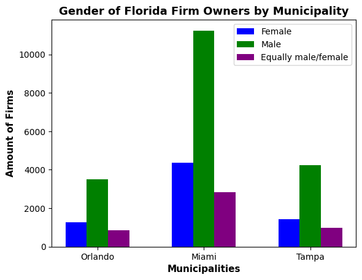

# assessment_8_pandas_census
1. Title: Assessment 8 Group 7 (GroupName) Pandas Visualization

2. Project Description:
We wanted to see how in the year 2018, each municipality businesses performed within the state of Florida, we also were interested in diversity, as well employee to firm size relation and attributes of each municipality.

3. Data Sources:
	(a) Annual Business Survey (ABS) APIs for 2019 
		-Characteristics of Businesses (2019) 
		-https://www.census.gov/data/developers/data-sets/abs.2018.html
		-survey for 2019 that uses data from 2018
	(b) (https://fred.stlouisfed.org/categories/30605)

4. Collaborators:

	-Nicholas Fenech Contributions: Visuals, ETL, ETL Report, Project Report, Read Me, GitHub Repo  
	-David Michaels Contributions:
	-Rebecca Blackham Contributions: Visuals, README, 

5. Visualizations:
	
	
	
