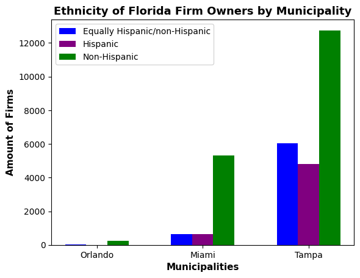
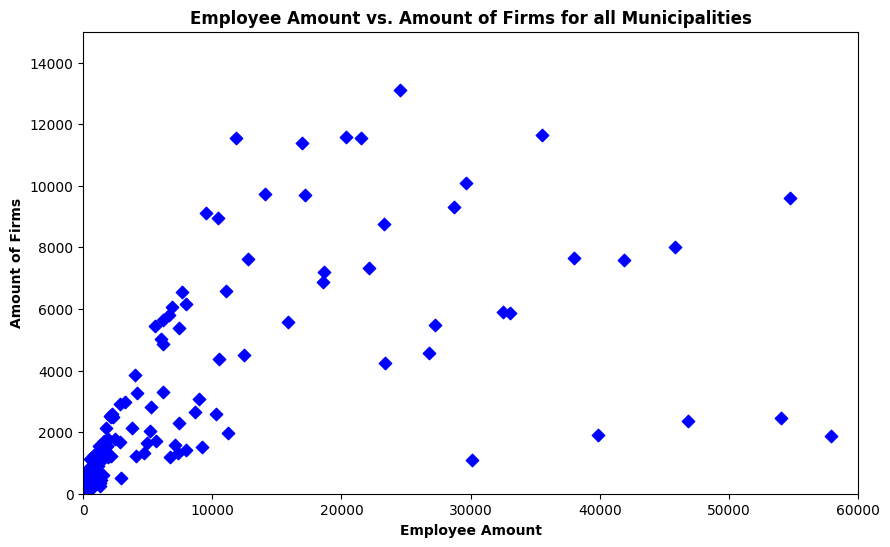

# Pandas Visualization and Analysis Report 

### Project Description:
In this small-scale yet insightful analysis, our goal was to gain a comprehensive understanding of business performance and diversity across municipalities within the vibrant state of Florida during the year 2018. We embarked on this project with a keen interest in uncovering valuable insights related to the economic landscape and workforce dynamics at the local level.

### Data Sources:
* [Annual Business Survey (ABS) APIs (2018)](https://www.census.gov/data/developers/data-sets/abs.2018.html)
* [Annual Business Survey (ABS) APIs (2019)](https://www.census.gov/data/developers/data-sets/abs.2019.html)
* [Federal Reserve Bank of St. Louis](https://fred.stlouisfed.org/categories/30605)

### Reports and Analysis: 
Please see these three notebooks below:

* [ETL Report](etl_report.ipynb)
* [Analysis and Conclusions](report_analysis.ipynb)
* [Visualizations](visualizations.ipynb)

### Visualization Examples:

.png>)
